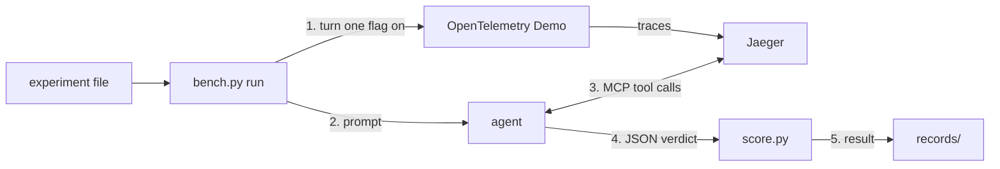

# jaeger-mcp-evals

A harness for evaluating the MCP tools and skills Jaeger serves to AI agents, as [jaegertracing/jaeger#9135](https://github.com/jaegertracing/jaeger/issues/9135) asks. Each trial breaks one service in the OpenTelemetry Demo with a feature flag, lets an agent investigate with only Jaeger's MCP tools, and scores its JSON verdict against the known cause. The records show which tools the agent called, whether it named the cause, and every factor that could change the result. It keeps no leaderboard and does not rank models.

**Status:** one scenario, one pinned result. On recommendationCacheFailure with claude-sonnet-5-5, the stock error-root-cause skill scored 0/10 PASS and a changed skill 7/10, n=10 per arm. See the [results page](docs/results/2026-09-recommendation-cache.md) and [records/INDEX.md](records/INDEX.md).



## Before you start

| Need | Detail |
|---|---|
| Tools | Python 3.11 or newer (standard library only), Docker with Compose v2, git, curl; `make preflight` checks them and the ports |
| Agent client | `run.client` in the experiment file: `cli` (Claude Code CLI on your logged-in plan, the default), `api` (experimental) or `codex` |
| Fixture | 22 containers (23 with Phoenix), about 2.9 GB RAM and 6 busy cores under load, a large first image pull |
| Free ports | 16686, 8013, 8016, 16006 |
| Host | `make` targets run on the fixture host, this machine by default; `bench.py` can drive a remote fixture over ssh |

With the `cli` client the agent starts with its built-in tools off and only `mcp__jaeger__*` allowed; a trial that shows any other tool scores INVALID.

## Quick Start

```bash
make setup     # demo checkout, overlay, bring-up, Phoenix; waits until "fixture ready"
make smoke     # one paid agent trial of harness/experiments/smoke-paymentfailure.json
python3 harness/bench.py run harness/experiments/<name>.json --dry-run  # free: pre-flight, planned order
python3 harness/bench.py run harness/experiments/<name>.json            # flip, trials, scoring, records
python3 harness/bench.py verify                                         # re-score from raw files
```

> [!WARNING]
> `make smoke` and `bench.py run` start paid agent trials. The dry run is free.

Jaeger is at http://localhost:16686/jaeger/ui and Phoenix at http://localhost:16006. Stop with `make down`, remove the containers with `make clean`. Everything a batch does is set in one checked-in file, `harness/experiments/<name>.json`; no command-line flag changes a run. Below 10 trials per arm a result only ranks the arms.

> [!NOTE]
> `make setup` and `make smoke` have not yet been run from a fresh clone; every recorded batch ran against a fixture on a separate host.

## Layout and docs

| Path | What it is |
|---|---|
| `harness/` | `bench.py` (run, verify, gates), `score.py`, `judge.py`, agent clients, prompts, scenarios, experiments, tests |
| `fixture/` | the OpenTelemetry Demo overlay and its scripts: [FIXTURE.md](fixture/FIXTURE.md) |
| `records/` | batch records, one `RESULT.md` per judged experiment, and [INDEX.md](records/INDEX.md) |
| [docs/USAGE.md](docs/USAGE.md) | the experiment file, running a batch, protocol, thresholds, reading results, scoring |
| [docs/SCENARIOS.md](docs/SCENARIOS.md) | adding or editing a scenario |
| [docs/RECORD.md](docs/RECORD.md), [docs/TUNING.md](docs/TUNING.md) | every key a run records; each factor that can change a result |
| [docs/results/](docs/results/) | results pages; new ones start from [TEMPLATE.md](docs/results/TEMPLATE.md) |
| [CHANGELOG.md](CHANGELOG.md), [CONTRIBUTING.md](CONTRIBUTING.md) | scenario versions and comparability; tests and DCO sign-off |

Licensed under Apache 2.0; see LICENSE.
