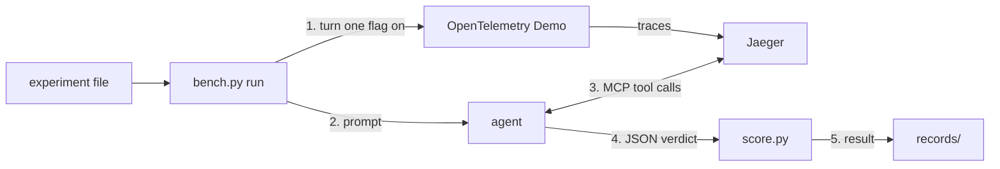

# jaeger-mcp-evals

Status: three scenarios pass readiness (paymentFailure, adFailure, paymentUnreachable); the pre-registered experiment desc-change-sep28 failed its thresholds on 2026-09-26 ([records/INDEX.md](records/INDEX.md), [records/desc-change-sep28/NOTES.md](records/desc-change-sep28/NOTES.md)).

A harness for evaluating the MCP tools and skills Jaeger serves to AI agents against trace-solvable faults, as jaegertracing/jaeger#9135 asks. Each trial breaks one service in the OpenTelemetry Demo with a feature flag, lets an agent investigate with only Jaeger's MCP tools, and scores its JSON verdict against the known cause. With the `cli` client the Claude Code CLI starts with its built-in tools off (`--tools ""`) and only `mcp__jaeger__*` allowed. The records show which tools the agent called, whether it named the cause, and every factor that could change the result. It keeps no leaderboard and does not rank models.

## Before you start

- Python 3.11 or newer (standard library only), Docker with Compose v2, git and curl; `make preflight` checks them and the ports. Agent client, set by `run.client` in the experiment file: `cli` (Claude Code CLI on your logged-in plan, the default and what `make smoke` uses), `api` (own loop, experimental, provider key in fixture.env) or `codex`.
- The fixture is 22 containers (23 with Phoenix): about 3.5 GB RAM idle (an estimate: the six services removed in the trim measured about 1.9 GB of the earlier 5.3 GB) and 6 cores busy under load (measured on a 6-core 24 GB host), a large first image pull, and free ports 16686, 8013, 8016 and 16006.
- `make` targets run on the fixture host, this machine by default; `bench.py` can drive a fixture on a remote host over ssh.
- Success: `make up` prints "fixture ready", http://localhost:16686/jaeger/ui shows traces and Phoenix answers on http://localhost:16006. Stop with `make down`, remove the containers with `make clean`. Times and details: docs/USAGE.md.

## Quick Start

`make setup`, `make smoke` and the Phoenix export have not yet been run from a fresh clone; every recorded batch ran against a fixture on a separate host.

```bash
make setup     # demo checkout, overlay, bring-up, Phoenix; waits until ready (fixture/FIXTURE.md)
make smoke     # one paid agent trial of harness/experiments/smoke-paymentfailure.json
# your own experiment: copy an experiment file to harness/experiments/<name>.json
python3 harness/bench.py run harness/experiments/<name>.json --dry-run  # pre-flight, planned order
python3 harness/bench.py run harness/experiments/<name>.json            # flip, trials, scoring, records
python3 harness/bench.py verify         # re-score from raw files, check records/INDEX.md
python3 harness/bench.py export runs/<scenario>/<batch-id>  # optional: trajectories to Phoenix
```



Everything a batch does is set in one checked-in file, `harness/experiments/<name>.json`: scenario, client and model, limits, trials per arm, seed, each arm's prompt, Jaeger image and tools, and the thresholds that decide the result. No command-line flag changes a run. Every number comes from `bench.py verify`, which re-scores the raw trajectories; below 10 trials per arm a result only ranks the arms.

## Layout

- `harness/`: `bench.py` (run, verify, gates), `score.py`, `judge.py`, the agent clients, prompts, scenarios and experiments
- `harness/tests/`: the offline test suite
- `fixture/`: the overlay for the OpenTelemetry Demo and the scripts that apply it and build variant images
- `records/`: batch records, one `RESULT.md` per judged experiment, and `INDEX.md`

## Docs

- docs/USAGE.md: the experiment file, running a batch, thresholds, reading results, scoring
- docs/SCENARIOS.md: adding or editing a scenario
- docs/RECORD.md: every key a run records
- docs/TUNING.md: each factor that can change a result and where it is recorded
- fixture/FIXTURE.md: installing and operating the fixture
- CHANGELOG.md: scenario versions and comparability; CONTRIBUTING.md: tests and DCO sign-off

## License

Apache License 2.0; see LICENSE.
