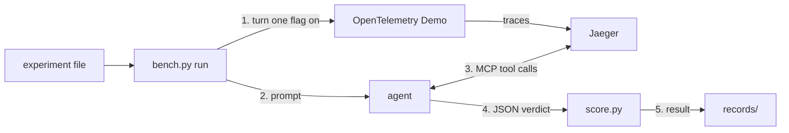

# jaeger-mcp-evals

Status: three scenarios pass readiness (paymentFailure, adFailure, paymentUnreachable); the pre-registered experiment desc-change-sep28 is recorded and judged under records/.

A harness for evaluating the MCP tools and skills Jaeger serves to AI agents against trace-solvable faults, as jaegertracing/jaeger#9135 asks. Each trial breaks one service in the OpenTelemetry Demo with a feature flag, lets an agent investigate with only Jaeger's MCP tools, and scores its JSON verdict against the known cause. The records show which tools the agent called, whether it named the cause, and every factor that could change the result. It keeps no leaderboard and does not rank models.

## Quick Start

```bash
make setup     # demo checkout, overlay, bring-up, Phoenix; waits until ready (fixture/FIXTURE.md)
make smoke     # one paid agent trial of harness/experiments/smoke-paymentfailure.json
# your own experiment: copy an experiment file to harness/experiments/<name>.json
python3 harness/bench.py run harness/experiments/<name>.json --dry-run  # pre-flight, planned order
python3 harness/bench.py run harness/experiments/<name>.json            # flip, trials, scoring, records
python3 harness/bench.py verify         # re-score from raw files, check records/INDEX.md
python3 harness/bench.py export runs/<scenario>/<batch-id>  # optional: trajectories to Phoenix
```



Everything a batch does is set in one checked-in file, `harness/experiments/<name>.json`: scenario, client and model, limits, trials per arm, seed, each arm's prompt, Jaeger image and tools, and the thresholds that decide the result. No command-line flag changes a run. Every number comes from `bench.py verify`, which re-scores the raw trajectories; below 10 trials per arm a result only ranks the arms.

## Layout

- `harness/`: `bench.py` (run, verify, gates), `score.py`, `judge.py`, the agent clients, prompts, scenarios and experiments
- `harness/tests/`: the offline test suite
- `fixture/`: the overlay for the OpenTelemetry Demo and the scripts that apply it and build variant images
- `records/`: batch records, one `RESULT.md` per judged experiment, and `INDEX.md`
- `docs/`: the manual

## Docs

- docs/USAGE.md: the experiment file, running a batch, thresholds, reading results, scoring
- docs/SCENARIOS.md: adding or editing a scenario
- docs/RECORD.md: every key a run records
- docs/TUNING.md: each factor that can change a result and where it is recorded
- fixture/FIXTURE.md: installing and operating the fixture
- CHANGELOG.md: scenario versions and comparability; CONTRIBUTING.md: tests and DCO sign-off

## Requirements

- Python 3.11 or newer, standard library only
- One agent client, chosen by `run.client`: `api` (`ANTHROPIC_API_KEY`, or `OPENAI_API_KEY` and `OPENAI_BASE_URL` for provider `openai`), `cli` (the Claude Code CLI, logged in) or `codex` (the OpenAI Codex CLI)
- Docker and Docker Compose running the OpenTelemetry Demo 3.0.0 with the overlay in `fixture/`, locally or on a remote host over ssh

## License

Apache License 2.0; see LICENSE.
